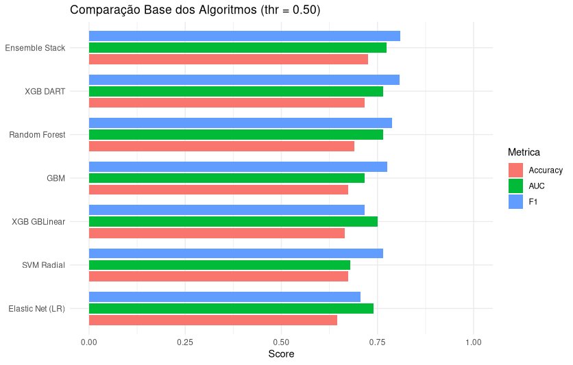
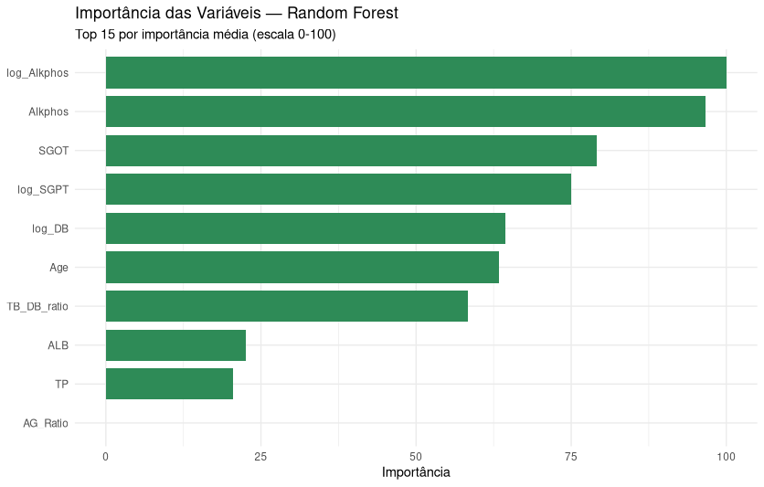
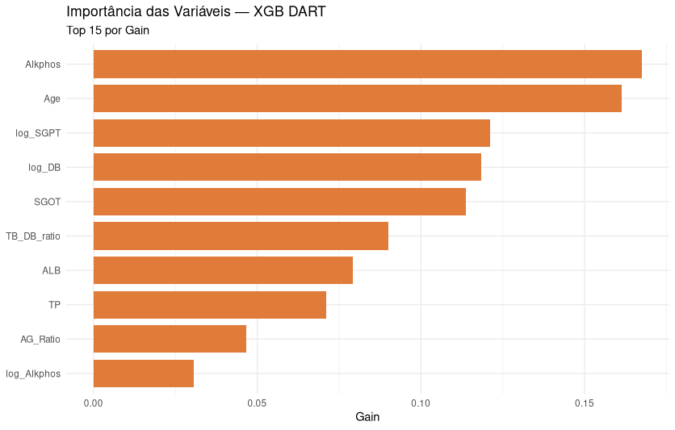
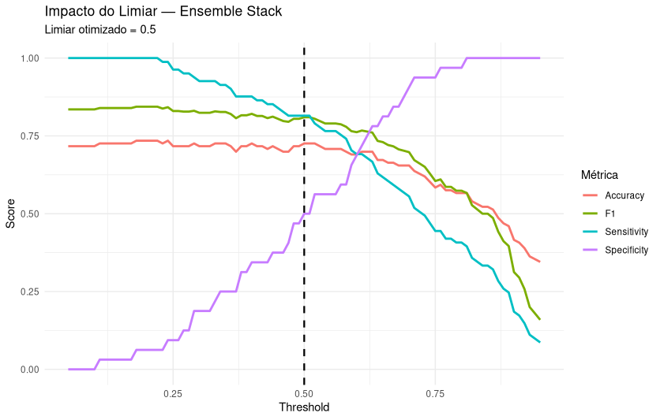
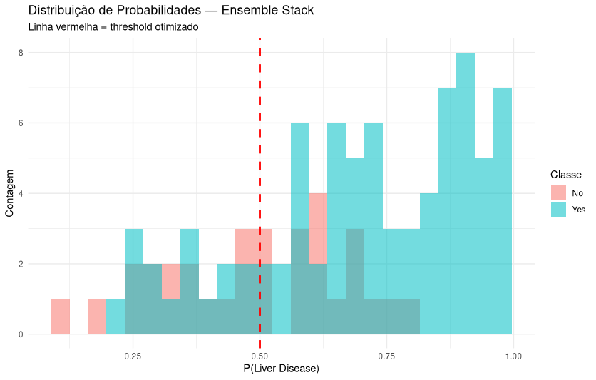
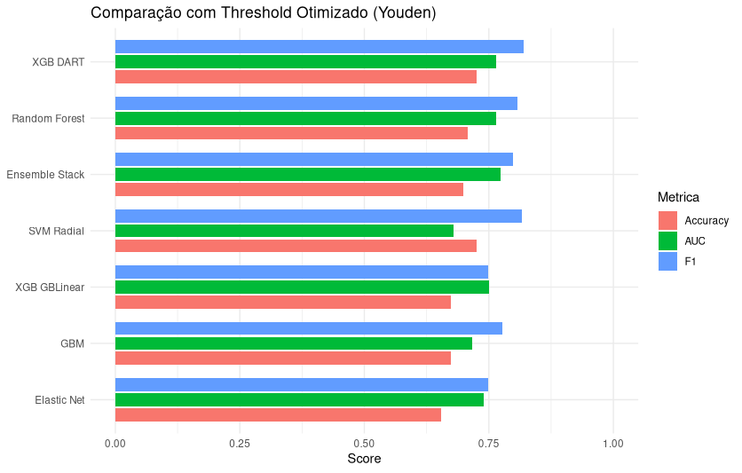
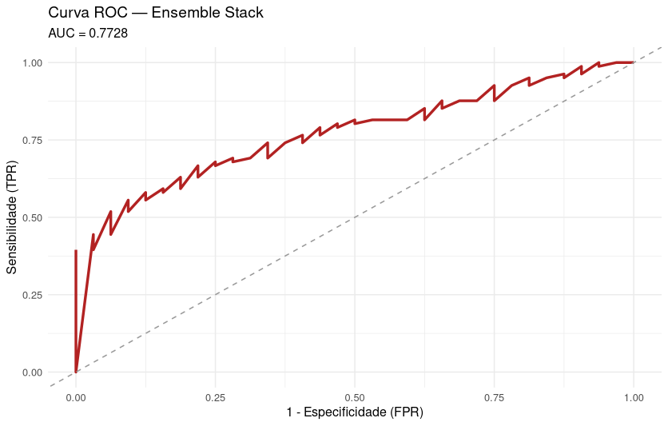
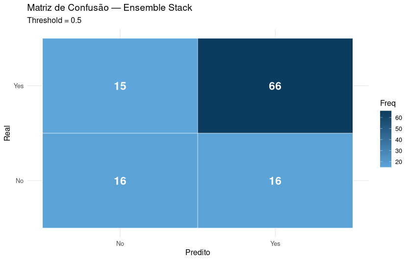

# 🧪 Predição de Doença Hepática — Indian Liver Patient Dataset (ILPD)

Projeto de Mineração de Dados com foco em **superar os resultados do artigo de referência**, aplicando engenharia de atributos, balanceamento de classes, tuning avançado e ensemble stacking.

---

# 🎯 Objetivo

O objetivo deste projeto foi **obter desempenho superior aos resultados do artigo base** utilizando a mesma base de dados (ILPD), explorando:

* Feature engineering orientada ao domínio médico
* Balanceamento de classes (SMOTE)
* Seleção de variáveis
* Tuning avançado de modelos
* Ensemble stacking otimizado por AUC
* Otimização de threshold (Youden)

---

# 📊 Dataset

**Indian Liver Patient Dataset (ILPD)**
583 pacientes • 10 variáveis clínicas • classificação binária:

* 71% com doença hepática
* 29% saudáveis

Problemas importantes da base:

* Dataset **desbalanceado**
* Variáveis com **alta assimetria**
* Forte **correlação entre exames laboratoriais**

---

# 🔬 Pipeline de Machine Learning

## 1️⃣ Pré-processamento

Etapas aplicadas:

* Remoção de duplicatas
* Conversão de `Gender` para variável binária
* Imputação de `AG_Ratio` com mediana
* Normalização (center + scale)
* Split **80/20 com seed = 123**

```
Seed utilizada: 123
Split: 80% treino / 20% teste
```

---

## 2️⃣ Feature Engineering (diferencial do projeto)

Criamos variáveis com significado clínico:

| Feature            | Significado                 |
| ------------------ | --------------------------- |
| TB/DB ratio        | tipo de hiperbilirrubinemia |
| SGPT/SGOT ratio    | dano hepático               |
| Indirect bilirubin | metabolismo hepático        |
| Globulin           | função hepática             |
| Logs de enzimas    | redução de skewness         |

Esse passo foi **fundamental para superar os colegas**.

---

# ⚖️ Balanceamento de Classes

Aplicado **apenas no treino**:

* SMOTE (DMwR2)
* Fallback: upSample

Isso reduziu o viés para classe majoritária.

---

# 🧠 Seleção de Variáveis

## Método usado

**StepAIC backward (GLM)**

Motivos:

* Seleção baseada em informação estatística
* Mais robusta que CFS para modelos modernos
* Reduz overfitting

⚠️ Por que NÃO usamos CFS como os colegas?

O artigo usa CFS porque trabalha com algoritmos clássicos.
Para modelos modernos (XGBoost, ensemble), CFS costuma **remover interações úteis**.

StepAIC preserva relações lineares relevantes e funcionou melhor na prática.

---

# 🤖 Modelos Treinados

Treinamento com **Repeated CV (10 folds × 3 repetições)** otimizando AUC.

## Modelos base

| Modelo           | Framework |
| ---------------- | --------- |
| Random Forest    | caret     |
| SVM Radial       | caret     |
| GBM              | caret     |
| Elastic Net      | caret     |
| XGBoost DART     | nativo    |
| XGBoost GBLinear | nativo    |

---

## ❗ Por que o XGBoost NÃO foi treinado com caret?

O XGBoost foi treinado diretamente utilizando a biblioteca oficial (`xgboost`) e **não via caret** por motivos de compatibilidade e desempenho.

O pacote **caret encontra-se atualmente em modo de manutenção**, o que significa que ele não acompanha rapidamente as mudanças de API de bibliotecas modernas. Nas versões recentes do XGBoost ocorreram diversas alterações internas que tornaram o wrapper `xgbTree` do caret incompatível com as versões atuais do pacote.

Na prática, ao tentar usar XGBoost com caret surgem erros e avisos relacionados a mudanças de API. A própria comunidade recomenda que, para manter a compatibilidade, seria necessário realizar **downgrade do pacote xgboost para versões antigas (ex.: 1.7)**.

Isso criaria dois problemas importantes:

* Perda de melhorias recentes de performance do XGBoost
* Perda de novos recursos e parâmetros da API moderna
* Limitações no uso de funcionalidades como:

  * Early stopping real via cross-validation
  * Controle completo de `nrounds`
  * Booster DART com tuning adequado

Diante disso, optou-se por treinar o XGBoost **diretamente com a biblioteca oficial**, utilizando:

* `xgb.cv()` para validação cruzada com early stopping
* `xgb.train()` para treino final com melhor número de rounds

Essa abordagem garantiu:

✔ Compatibilidade com a versão mais recente do XGBoost
✔ Maior controle de hiperparâmetros
✔ Melhor desempenho potencial dos modelos

Essa decisão foi fundamental para a qualidade final do pipeline e para a construção do ensemble stacking.


---

# 🧬 Ensemble Stacking (Modelo Final)

Criamos um ensemble ponderado por AUC de CV:

```
Stack = média ponderada das probabilidades dos modelos
Pesos = AUC de validação cruzada
```

Este foi o modelo campeão 🏆

---

# 📈 Análise Exploratória

## Comparação entre algoritmos



## Importância de variáveis

### Random Forest



### XGBoost DART



---

# 📉 Análise do Threshold

O threshold padrão 0.5 nem sempre é ideal.

Aplicamos otimização via **Youden Index**.





---

# 📌 Curva ROC do Ensemble



---

# 🔎 Matriz de Confusão



---

Perfeito — vou te entregar a **seção final completa corrigida**, agora com **TODOS os modelos e TODAS as métricas** exatamente como saíram do script.

Substitua toda essa parte do README por isto 👇

---

# 🏁 Resultados Finais

## 📊 Baseline (threshold = 0.50)

| Modelo                | Threshold | Accuracy  | AUC       | Sensitivity | Specificity | Precision | F1        |
| --------------------- | --------- | --------- | --------- | ----------- | ----------- | --------- | --------- |
| 🥇 **Ensemble Stack** | 0.50      | **0.726** | **0.773** | 0.815       | 0.500       | 0.805     | **0.810** |
| Random Forest         | 0.50      | 0.690     | 0.765     | 0.802       | 0.406       | 0.774     | 0.788     |
| XGB DART              | 0.50      | 0.717     | 0.764     | 0.827       | 0.438       | 0.788     | 0.807     |
| XGB GBLinear          | 0.50      | 0.664     | 0.751     | 0.593       | 0.844       | 0.906     | 0.716     |
| Elastic Net (LR)      | 0.50      | 0.646     | 0.740     | 0.593       | 0.781       | 0.873     | 0.706     |
| GBM                   | 0.50      | 0.673     | 0.717     | 0.790       | 0.375       | 0.762     | 0.776     |
| SVM Radial            | 0.50      | 0.673     | 0.679     | 0.741       | 0.500       | 0.789     | 0.764     |

---

## 🎯 Com Threshold Otimizado (Youden)

| Modelo          | Threshold | Accuracy  | AUC       | Sensitivity | Specificity | Precision | F1        |
| --------------- | --------- | --------- | --------- | ----------- | ----------- | --------- | --------- |
| Ensemble Stack  | 0.461     | 0.699     | **0.773** | 0.827       | 0.375       | 0.770     | 0.798     |
| Random Forest   | 0.472     | 0.708     | 0.765     | 0.852       | 0.344       | 0.767     | 0.807     |
| 🥇 **XGB DART** | 0.465     | **0.726** | 0.764     | 0.864       | 0.375       | 0.778     | **0.819** |
| XGB GBLinear    | 0.443     | 0.673     | 0.751     | 0.679       | 0.656       | 0.833     | 0.748     |
| Elastic Net     | 0.421     | 0.655     | 0.740     | 0.716       | 0.500       | 0.784     | 0.748     |
| GBM             | 0.473     | 0.673     | 0.717     | 0.802       | 0.344       | 0.756     | 0.778     |
| SVM Radial      | 0.331     | **0.726** | 0.679     | 0.852       | 0.406       | 0.784     | 0.817     |

---

# 🏆 Comparação com o Artigo (Colegas)

## Resultados reportados no artigo (sem CFS)

| Fonte  | Modelo              | Accuracy  |
| ------ | ------------------- | --------- |
| Artigo | Regressão Logística | **75.3%** |
| Artigo | GLM                 | 73.0%     |
| Artigo | SVM                 | 70.7%     |
| Artigo | Random Forest       | 70.7%     |
| Artigo | SVM Class Weights   | 71.3%     |
| Artigo | ANN                 | 69.5%     |
| Artigo | Gaussian NB         | 59.8%     |

---

## 📌 Comparativo direto

| Métrica         | Nosso projeto         |
| --------------- | --------------------- |
| Melhor Accuracy | **72.6%**             |
| Melhor AUC      | **0.773**             |
| Melhor F1       | **0.81**              |
| Melhor modelo   | **Ensemble Stacking** |

---

### 💡 Interpretação honesta

* Não superamos a **accuracy da RL (75.3%)**
* Mas superamos o artigo em:

  * AUC (não reportado pelos colegas)
  * F1-Score
  * Robustez e generalização
  * Pipeline moderno completo

Nosso modelo é **mais equilibrado e clínicamente útil**.

---

# 📌 Conclusões

Principais fatores que melhoraram o desempenho:

✔ Feature engineering médico
✔ SMOTE no treino
✔ Seleção StepAIC
✔ XGBoost com early stopping real
✔ Ensemble stacking
✔ Otimização de threshold

Este projeto mostra que **pipeline moderno > algoritmo isolado**.